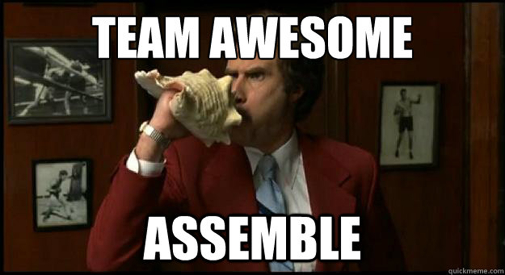

# Let's Go Full Stack!

>**Note:** This will be a pair programming activity.  You will only need to use one computer, but make sure one partner is driving half the time, and the other driving the other half.

## A Full Stack App From Scratch

There is no starter code for this app, just bullet points and the knowledge that you can use any earlier homeworks or lessons as a reference.  The journey is more important than the finished product here (solution coming soon), so just get as far as you can and focus on learning with your partner.

### Summary

Throughout this lab, we will hit a lot of the pieces we introduced earlier in the unit.  In order, you will:
1. Build out your folder directory
2. Achieve a server-side "Hello World"
3. Add view engine and achieve a client-side "Hello World"
4. Attach your front end css && js as well as jQuery & bootstrap to your index.ejs file
5. Build out a view route part1.
6. Build out a view route part2.
7. Make a request to the back end with AJAX
8. Respond to this request with Express
9. Databasing
10. Use this database to respond to the AJAX request

### Step 1: Initial Setup!

There can be quite a bit of variety in your folder setup and it may change throughout your project so don't look at this as the only 'way'. We are going to start this way as a review of what will go where before we even start:

- Create a directory - name it what you want - this is where everythings going to go. I will call it root
- cd into root and run `npm init -y` inside.
- now lets make our structure. Create directories called `config controllers models public views`
- our public directory has two subdirectories `scripts styles`
- our views directory has one subdirectory `partials`

add some files that we know we are going to use:
  - server.js
  - seed.js
  - config/routes.js
  - controllers/api_controller.js
  - controllers/view_controller.js
  - models/index.js 
  - models/{{YOUR PROJECTS MODEL NAME}}.js
  - public/styles/main.css
  - public/scripts/app.js
  - views/index.ejs

- finally lets step through these files and add a reminder comment about what the fuck each one of these files is responsible for.

### Step 2: Get a Hello Server!

In order to set up our server, we need to do a few things all of the following steps take place inside of server.js:

- We know we are going to need a handful of packages...lets `npm install` them all now and then we will require them as we need them. 
- install `express mongoose ejs` and `body-parser` with `npm`
- now inside server.js require `express` 
- create a variable named `app` and set it equal to `express()`
- create a variable named `PORT` and set it equal to `process.env.PORT || 3000`
- add the express function to connect to your PORT variable
- Start up your `server.js` with `node` or `nodemon`

### Step 3: View setup and Hello Client!
...by then end of this step you should be kidnda like... 'damn...ejs is kinda tight...'
In this step we will configure our app to display ejs files in server.js file, above our app.listen function add:

- `app.set('views', './views')`
- `app.engine('ejs', require('ejs').renderFile)`
- `app.set('view engine', 'ejs')`
- whats neat about ejs is that it starts as html. lets set up index.ejs to look like an html boilerplate with a div that reads hello world.  
- add an express `get` function to `'/'` -- it should have a calledback function with `req` and `res` parameters and we want the response to `render` our `index` --- this is our home route ---
- you should now see the index page rendered in our browser.
- add the links and script tags your front end will need to your index.ejs file (i can think of 5 off the top of my head)
- now we use express to tell the app where to look for `public` facing files:
- add `app.use(express.static(__dirname + '/public'));` above our route in the server.js file 

### Step 4: Finish Initial View Setup

- add 2 new to ejs files to the partials directory - `header.ejs` & `footer.ejs`
- Move everything except our `
Hello World
` out of our index.ejs and into our `header.ejs` & `footer.ejs`. i trust you to figure out what goes where.
- include your `header` and `footer` in your `index.ejs.` 
- create another ejs file ---- not a partial - a main view --- call it winning.ejs. 
- include your header and footer in here as well. 
- now slap a div in the middle. leave yourself a quick reminder of how awesome you are.
- check-in: what is the difference between a partial and a main view? this is important. 

### Step 5: Build out a View Route

Guess where we start --- `server.js!`
- move the `app.get` route out of our `server.js` file and into our `routes.js` file
- now configure the `routes.js` file. Require express...specifically the express' `Router()`. Save that to a variable named router.
- now lets `export` our router from the routes.js file
- move back to server.js and create variable named `router` that requires the routes.js file
- use express to tell our app what to do with routing requests. put this right before we start our server: `app.use(router)`
- copy your route callback function and paste it in the view_controller.js file. name the function index
- export the index function.
- move over to routes.js and create a variable named view that requires the view_controller.js file
- simplify the `router.get('/')` callback so that it uses the view_controller

YAAAAASSS. Now prove to yourself that you're starting to get this shit and build a view route to render your winner.ejs

### Step 7: AJAX Requests

- in `index.ejs` create a `button` element with an id `test`
- In `app.js` create an event listener on that button that sends an AJAX `$.get` request to `/api/test`.
- `console.log` the `response` to this query
- Look in Developer Tools.  Oh no, we're failing...or...oh yay, we have an error message!

### Step 8: Express Response

- In `routes.js` add a route for the `/api/test` GET request you just sent.
- give the route a callback to `api.index`
- create a variable named api that requires our api_controller.js file
- in api_controller.js create an index function which takes (req,res) params. the function should `res`pond with the following JSON object `{test: 'this is a test'}`
- export this method as you did in your view_controller
- what do we expect to see when test?

### Step 9: Databaseeding

- head to your model file in your model directory
- Require `mongoose` in this file
- Create a `Schema` for a with at least a `name` field that is a `String`
- Create a `Model` for a your schema
- `export` this `Model` as a `module`
- Create a file called `seed.js`
- `require` your model file in your seed file
- Connect to a database called `{{dealers_choice}}` in your seed file
- `remove` any existing instances of your model
- `create` a new instance of your model
- Close out the database connection
- run your `seed.js` file
- Check the `mongo` CLI or `Robo3t` to make sure your  was added to the `people` collection in the `json_server` database

### Step 10: Attack of the Full Stack.
In this step we pull everything together. Since its the boss level there has to be an added challenge...sooo...directions will not specify the filenames.
- change the AJAX get request from `/api/test` to `/api/{{YOUR MODEL}}`
- update the backend routes path to match the AJAX request url
- `require` your model in your api controller
- Change the `index` function in your api controller to `find` all instances of your model from the DB. Then respond with that instead of the hardcoded JSON from earlier.
- Connect to your database in your server file. This means requiring `mongoose`.
- when we click the button on our front end we should see our database data show up in the console.

### Pairs

First, come up to the front of the room.

Now, on a scale of 1-5 how confident do you feel in your ability to code this app out with a partner?

Raise this number in the air, and find a partner that has the same number as you.

Figure out whose laptop you're using, and who's typing first, then dive in!

